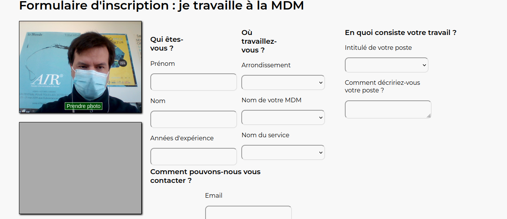

# Workshop_bioInspiration_Ecoscope

Cette application est un prototype de trombinoscope avancé basé sur les compétences
et les champs d'actions des personnes plutôt que sur la hiérarchie.

## Utilisation

L'interface principale se trouve sur l'url de base du serveur.

L'interface d'ajout d'un utilisateur se fait sur l'url `/form.php`.

Ce qui fonctionne dans ce prototype :
- Affichage de la liste des personnes dans un graphe
- Filtre des personnes dans le graphe
- Ajout d'une personne (temporairement) dans le graphe

Ce qui ne fonctionne pas dans ce prototype :
- L'ajout d'utilisateur n'affiche que la dernière personne autorisée. C'est une 
limitation volontaire pour les besoins de la démo et des questions de droits à
l'image/oubli. Donc tout nouvel ajout de personne supprimera la personne précédemment
ajoutée.
- L'envoi de la photo par le formulaire d'ajout de personne est, lui aussi, bloqué.
Toutefois, la prise de photo fonctionne pour les besoins de la démo.

## Installation

Un serveur (apache), PHP et une bibliothèque javascript (vis.js) sont nécessaires pour
faire fonctionner l'application. L'installation de la bibliothèque vis.js peut se faire
de la manière que vous souhaitez (pensez juste à adapter le code HTML l'appelant
dans votre `index.php`)

Pour le moment, il suffit de copier le dossier dans un dossier apache et d'ouvrir l'url
correspondante dans votre navigateur pour en voir le résultat.

Un `Dockerfile` est en cours de tests.
