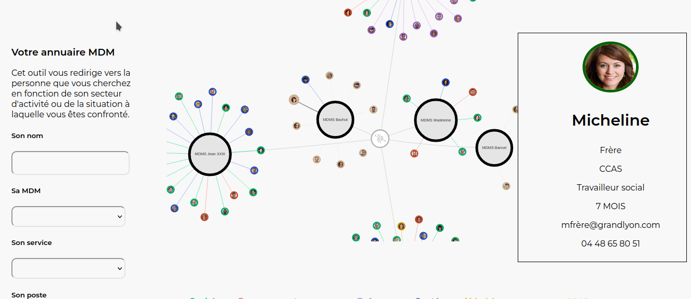

# Workshop_bioInspiration_Ecoscope

Cette application est un prototype de trombinoscope avancé basé sur les compétences
et les champs d'actions des personnes plutôt que sur la hiérarchie.

Les auteurs :
- ADAM Camille (design) [site](https://www.camilleadam.com/)
- CREANTOR Maëlys (design) [LinkedIn](https://www.linkedin.com/in/maelys-creantor-a666461bb/)
- RACINE Pierre-Alexandre (développement)

Une démo est visible [ici](https://ecoscope.projets.erasme.org/).

## Utilisation

L'interface principale se trouve sur l'url de base du serveur.



L'interface d'ajout d'un utilisateur se fait sur l'url `/form.php`.


Ce qui fonctionne dans ce prototype :
- Affichage de la liste des personnes dans un graphe
- Filtre des personnes dans le graphe
- Ajout d'une personne (temporairement) dans le graphe


Ce qui ne fonctionne pas dans ce prototype :
- L'ajout d'utilisateur n'affiche que la dernière personne autorisée. C'est une 
limitation volontaire pour les besoins de la démo et des questions de droits à
l'image/oubli. Donc tout nouvel ajout de personne supprimera la personne précédemment
ajoutée.
- L'envoi de la photo par le formulaire d'ajout de personne est, lui aussi, bloqué.
Toutefois, la prise de photo fonctionne pour les besoins de la démo.

## Installation

Un serveur (apache), PHP et une bibliothèque javascript (vis.js) sont nécessaires pour
faire fonctionner l'application. L'installation de la bibliothèque vis.js peut se faire
de la manière que vous souhaitez (pensez juste à adapter le code HTML l'appelant
dans votre `index.php`)

Pour le moment, il suffit de copier le dossier dans un dossier apache et d'ouvrir l'url
correspondante dans votre navigateur pour en voir le résultat.

### Installation automatisée

Un `Dockerfile` est disponible. Suivez ces étapes :

```bash
# Clonage du dépôt
git clone https://github.com/urbanlab/Workshop_bioInspiration_Ecoscope.git ~/Projets/ecoscope
# Déplacement dans notre code
cd ecoscope/src
# Installation des bibliothèques js.
npm install
# Construction de l'image
cd ..
docker build -t ecoscope .
# Lancement du conteneur.
docker run -d -p 5000:80 --name ecoscope ecoscope
```

Une fois ce conteneur actif, vous pouvez ouvrir les urls locales suivantes :
- [http://localhost:5000/](http://localhost:5000/)
- [http://localhost:5000/form.php](http://localhost:5000/form.php)

## Administration ERASME

Il est possible de pousser sur dockerhub une image qui pourrait être facilement réutilisée.
```bash
# Connectez-vous à docker en ligne de commande
docker login --username=erasme
# Récupérez l'identifiant de l'image construite (remplacez 12charcode avec)  
docker tag 12charcode erasme/ecoscope
# Envoyez l'image sur docker
sudo docker push erasme/ecoscope
```